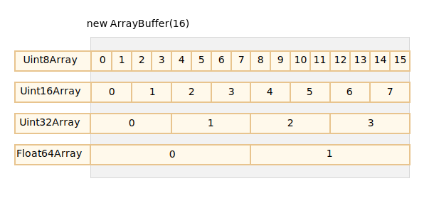

## Dependency Injection

dependency injection is a technique whereby one object supplies the dependencies of another object


[./di.js](./di.js)

```js
function Wheels() {
  this.action = () => console.log("The wheels go 'round and 'round.");

  console.log("Made some wheels.");
}

function Pistons() {
  this.action = () => console.log("The pistons fire up and down.");

  console.log("Made some pistons.");
}

function Engine() {
  this.pistols = new Pistons();

  this.action = () => {
    this.pistols.action();

    console.log("The engine goes vrom vrom.");
  };

  console.log("Made an engine.");
}

function Car() {
  this.wheels = new Wheels();
  this.engine = new Engine();

  this.action = () => {
    this.wheels.action();
    this.engine.action();
    console.log("The car drives by");
  };

  console.log("Made a car.");
}

const car = new Car();

car.action();

// Inject dependencies

function Engine(pistols) {
  this.pistols = pistols;

  this.action = () => {
    this.pistols.action();

    console.log("The engine goes vrom vrom.");
  };

  console.log("Made an engine.");
}

function Car(wheels, engine) {
  this.wheels = wheels;
  this.engine = engine;

  this.action = () => {
    this.wheels.action();
    this.engine.action();
    console.log("The car drives by");
  };

  console.log("Made a car.");
}

const wheels = new Wheels();
const pistons = new Pistons();
const engine = new Engine(pistons);

const Car = new Car(wheels, engine);
```

### Symbol factory function

By specification, object property keys may be either of string type, or of symbol type. Not numbers, not booleans, only strings or symbols, these two types.

A “symbol” represents a unique identifier.

```js
const id = Symbol();
// or
const id = Symbol("symbol's description");
```

Symbols are guaranteed to be `unique`. For instance, here are two symbols with the same description – they are not equal:

```js
let id1 = Symbol("id");
let id2 = Symbol("id");

alert(id1 == id2); // false
```

Symbols don’t auto-convert to a string

```js
let id = Symbol("id");
alert(id); // TypeError: Cannot convert a Symbol value to a string
alert(id.toString()); // Symbol(id), now it works
alert(id.description); // id
```

Symbols allow us to create “hidden” properties of an object, that no other part of code can accidentally access or overwrite.

```js
const id = Symbol("id");

const user = { [id]: 1 };

alert(user[id]); // Accessing to value by unique key
```

Symbols are skipped by `for…in` or `Object.keys(user)`

```js
let id = Symbol("id");
let user = {
  name: "John",
  age: 30,
  [id]: 123,
};

for (let key in user) alert(key); // name, age (no symbols)

// the direct access by the symbol works
alert("Direct: " + user[id]);
```

**In contrast, Object.assign copies both string and symbol properties:**

Global symbols

```js
// read from the global registry
let id = Symbol.for("id"); // if the symbol did not exist, it is created

// read it again (maybe from another part of the code)
let idAgain = Symbol.for("id");

// the same symbol
alert(id === idAgain); // true

// get symbol by name
alert(Symbol.keyFor(id)); // id
```

### ArrayBuffer, binary arrays https://javascript.info/arraybuffer-binary-arrays

**ArrayBuffer is a memory area. What’s stored in it? It has no clue. Just a raw sequence of bytes.**

The basic binary object is ArrayBuffer – a reference to a fixed-length contiguous memory area

```js
let buffer = new ArrayBuffer(16); // create a buffer of length 16
alert(buffer.byteLength); // 16
```

This allocate a contiguous memory area of 16 byte an pre-fills it with zeros

**ArrayBuffer is not an array of something**

- It has fixed length we cannot increase or decrease it
- It takes exact specified space in memory that initialized with
- To access an individual bytes, another "view" object is required and not `buffer[index]`

To manipulate an ArrayBuffer, we need to use a `view` object.

<table class="standard-table">
 <tbody>
  <tr>
   <td class="header">Type</td>
   <td class="header">Value Range</td>
   <td class="header">Size in bytes</td>
   <td class="header">Description</td>
   <td class="header">Web IDL type</td>
   <td class="header">Equivalent C type</td>
  </tr>
  <tr>
   <td><a href="/en-US/docs/Web/JavaScript/Reference/Global_Objects/Int8Array" title="The Int8Array typed array represents an array of twos-complement 8-bit signed integers. The contents are initialized to 0. Once established, you can reference elements in the array using the object's methods, or using standard array index syntax (that is, using bracket notation)."><code>Int8Array</code></a></td>
   <td>-128 to 127</td>
   <td>1</td>
   <td>8-bit two's complement signed integer</td>
   <td><code>byte</code></td>
   <td><code>int8_t</code></td>
  </tr>
  <tr>
   <td><a href="/en-US/docs/Web/JavaScript/Reference/Global_Objects/Uint8Array" title="The Uint8Array typed array represents an array of 8-bit unsigned integers. The contents are initialized to 0. Once established, you can reference elements in the array using the object's methods, or using standard array index syntax (that is, using bracket notation)."><code>Uint8Array</code></a></td>
   <td>0 to 255</td>
   <td>1</td>
   <td>8-bit unsigned integer</td>
   <td><code>octet</code></td>
   <td><code>uint8_t</code></td>
  </tr>
  <tr>
   <td><a href="/en-US/docs/Web/JavaScript/Reference/Global_Objects/Uint8ClampedArray" title="The Uint8ClampedArray typed array represents an array of 8-bit unsigned integers clamped to 0-255; if you specified a value that is out of the range of [0,255], 0 or 255 will be set instead; if you specify a non-integer, the nearest integer&nbsp;will be set. The contents are initialized to 0. Once established, you can reference elements in the array using the object's methods, or using standard array index syntax (that is, using bracket notation)."><code>Uint8ClampedArray*</code></a></td>
   <td>0 to 255</td>
   <td>1</td>
   <td>8-bit unsigned integer (clamped)</td>
   <td><code>octet</code></td>
   <td><code>uint8_t</code></td>
  </tr>
  <tr>
   <td><a href="/en-US/docs/Web/JavaScript/Reference/Global_Objects/Int16Array" title="The Int16Array typed array represents an array of twos-complement 16-bit signed integers in the platform byte order. If control over byte order is needed, use DataView instead. The contents are initialized to 0. Once established, you can reference elements in the array using the object's methods, or using standard array index syntax (that is, using bracket notation)."><code>Int16Array</code></a></td>
   <td>-32768 to 32767</td>
   <td>2</td>
   <td>16-bit two's complement signed integer</td>
   <td><code>short</code></td>
   <td><code>int16_t</code></td>
  </tr>
  <tr>
   <td><a href="/en-US/docs/Web/JavaScript/Reference/Global_Objects/Uint16Array" title="The Uint16Array typed array represents an array of 16-bit unsigned integers in the platform byte order. If control over byte order is needed, use DataView instead. The contents are initialized to 0. Once established, you can reference elements in the array using the object's methods, or using standard array index syntax (that is, using bracket notation)."><code>Uint16Array</code></a></td>
   <td>0 to 65535</td>
   <td>2</td>
   <td>16-bit unsigned integer</td>
   <td><code>unsigned short</code></td>
   <td><code>uint16_t</code></td>
  </tr>
  <tr>
   <td><a href="/en-US/docs/Web/JavaScript/Reference/Global_Objects/Int32Array" title="The Int32Array typed array represents an array of twos-complement 32-bit signed integers in the platform byte order. If control over byte order is needed, use DataView instead. The contents are initialized to 0. Once established, you can reference elements in the array using the object's methods, or using standard array index syntax (that is, using bracket notation)."><code>Int32Array</code></a></td>
   <td>-2147483648 to 2147483647</td>
   <td>4</td>
   <td>32-bit two's complement signed integer</td>
   <td><code>long</code></td>
   <td><code>int32_t</code></td>
  </tr>
  <tr>
   <td><a href="/en-US/docs/Web/JavaScript/Reference/Global_Objects/Uint32Array" title="The Uint32Array typed array represents an array of 32-bit unsigned integers in the platform byte order. If control over byte order is needed, use DataView instead. The contents are initialized to 0. Once established, you can reference elements in the array using the object's methods, or using standard array index syntax (that is, using bracket notation)."><code>Uint32Array</code></a></td>
   <td>0 to 4294967295</td>
   <td>4</td>
   <td>32-bit unsigned integer</td>
   <td><code>unsigned long</code></td>
   <td><code>uint32_t</code></td>
  </tr>
  <tr>
   <td><a href="/en-US/docs/Web/JavaScript/Reference/Global_Objects/Float32Array" title="The Float32Array typed array represents an array of 32-bit floating point numbers (corresponding to the C float data type) in the platform byte order. If control over byte order is needed, use DataView instead. The contents are initialized to 0. Once established, you can reference elements in the array using the object's methods, or using standard array index syntax (that is, using bracket notation)."><code>Float32Array</code></a></td>
   <td>1.2x10<sup>-38</sup> to 3.4x10<sup>38</sup></td>
   <td>4</td>
   <td>32-bit IEEE&nbsp;floating point number ( 7 significant digits e.g. 1.1234567)</td>
   <td><code>unrestricted float</code></td>
   <td><code>float</code></td>
  </tr>
  <tr>
   <td><a href="/en-US/docs/Web/JavaScript/Reference/Global_Objects/Float64Array" title="The Float64Array typed array represents an array of 64-bit floating point numbers (corresponding to the C double data type) in the platform byte order. If control over byte order is needed, use DataView instead. The contents are initialized to 0. Once established, you can reference elements in the array using the object's methods, or using standard array index syntax (that is, using bracket notation)."><code>Float64Array</code></a></td>
   <td>5.0x10<sup>-324</sup> to 1.8x10<sup>308</sup></td>
   <td>8</td>
   <td>64-bit IEEE floating point number (16 significant digits e.g. 1.123...15)</td>
   <td><code>unrestricted double</code></td>
   <td><code>double</code></td>
  </tr>
  <tr>
   <td><a href="/en-US/docs/Web/JavaScript/Reference/Global_Objects/BigInt64Array" title="The BigInt64Array typed array represents an array of 64-bit signed integers in the platform byte order. If control over byte order is needed, use DataView instead. The contents are initialized to 0n. Once established, you can reference elements in the array using the object's methods, or by using standard array index syntax (that is, using bracket notation)."><code>BigInt64Array</code></a></td>
   <td>-2<sup>63</sup> to&nbsp;2<sup>63</sup>-1</td>
   <td>8</td>
   <td>64-bit two's complement signed integer</td>
   <td><code>bigint</code></td>
   <td><code>int64_t (signed long long)</code></td>
  </tr>
  <tr>
   <td><a href="/en-US/docs/Web/JavaScript/Reference/Global_Objects/BigUint64Array" title="The BigUint64Array typed array represents an array of 64-bit unsigned integers in the platform byte order. If control over byte order is needed, use DataView instead. The contents are initialized to 0n. Once established, you can reference elements in the array using the object's methods, or by using standard array index syntax (that is, using bracket notation)."><code>BigUint64Array</code></a></td>
   <td>0 to&nbsp;2<sup>64</sup>-1</td>
   <td>8</td>
   <td>64-bit unsigned integer</td>
   <td><code>bigint</code></td>
   <td><code>uint64_t (unsigned long long)</code></td>
  </tr>
 </tbody>
</table>

- legend
  \*Clamped is some sort of built-in data validation and e.g. it will convert the number less than 0 to 0 or grater than 255 to 255

A view object does not store anything on it’s own. It’s the “eyeglasses” that give an interpretation of the bytes stored in the ArrayBuffer.



- `Uit8Array` each byte //un signed integer
- `Uit16Array` each 2 bytes
- `Uit32Array` each 4 bytes
- `Float32Array` each 4 bytes
- `Float64Array` each 8 bytes

---

ArrayBuffer is the core object, the root of everything, the raw binary data.

But if we’re going to write into it, or iterate over it, basically for almost any operation – we must use a view, e.g:

---

```js
const buffer = new ArrayBuffer(16);

const view = new Unit32Array(buffer); // Uint32Array(4) [0, 0, 0, 0]

view.BYTES_PER_ELEMENT; // 4 bytes per integer

view.length; // 4 it stores that many integer
view.byteLength; // 16 the size of bytes

// let's write a value
view[0] = 123456;

for (let num of view) {
  console.log(num);
}
// 123456, 0, 0, 0
```

TypedArray: The common term for all these views (Uint8Array, Uint32Array, etc) is TypedArray

They are much more like regular arrays: have indexes and iterable.

There are 5 variants of arguments:

```ts
new TypedArray(buffer, byteOffset?, length?)
new TypedArray(object) // Array is an object
new TypedArray(typedArray)
new TypedArray(length)
new TypedArray()
```

1. If an `ArrayBuffer` argument is supplied, the view is created over it. We used that syntax already.

Optionally we can provide byteOffset to start from (0 by default) and the length (till the end of the buffer by default), then the view will cover only a part of the buffer.

2. If an Array, or any array-like object is given, it creates a typed array of the same length and copies the content.

```js
let arr16 = new Uint16Array([1, 1000]);
let arr8 = new Uint8Array(arr16);
alert(arr8[0]); // 1
alert(arr8[1]); // 232, tried to copy 1000, but can't fit 1000 into 8 bits
```

#### Out-of-bounds behavior

What if we attempt to write an out-of-bounds value into a typed array? There will be no error. But extra bits are cut-off.

```js
const uint8array = new Uint8Array();
// Uint8Array only provides 8 bits per value, that makes the available range from 0 to 255.

let num = 256;
num.toString(2); // 100000000 (binary representation)
let num_1 = 247;
num_1.toString(2); // 100000001

uint8array[0] = 256; // 0
uint8array[1] = 257; // 1
```

```js
// binary array of 4 bytes, all have the maximal value 255
let buffer = new Uint8Array([255, 255, 255, 255]).buffer;

let dataView = new DataView(buffer);

// get 8-bit number at offset 0
alert(dataView.getUint8(0)); // 255

// now get 16-bit number at offset 0, it consists of 2 bytes, together iterpreted as 65535
alert(dataView.getUint16(0)); // 65535 (biggest 16-bit unsigned int)

// get 32-bit number at offset 0
alert(dataView.getUint32(0)); // 4294967295 (biggest 32-bit unsigned int)

dataView.setUint32(0, 0); // set 4-byte number to zero, thus setting all bytes to 0
```

`DataView` is great when we store mixed-format data in the same buffer. E.g we store a sequence of pairs (16-bit integer, 32-bit float). Then DataView allows to access them easily.
